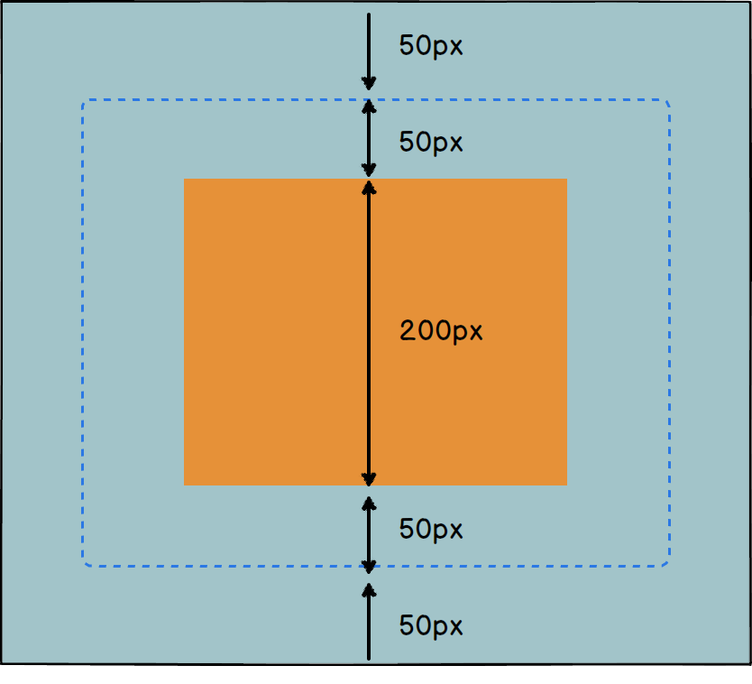
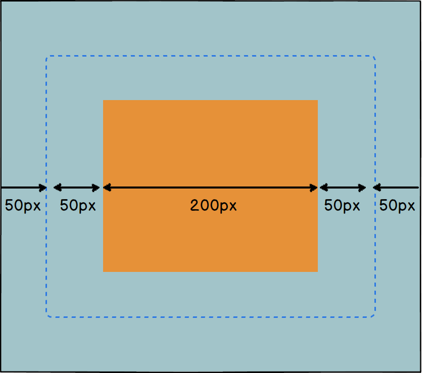
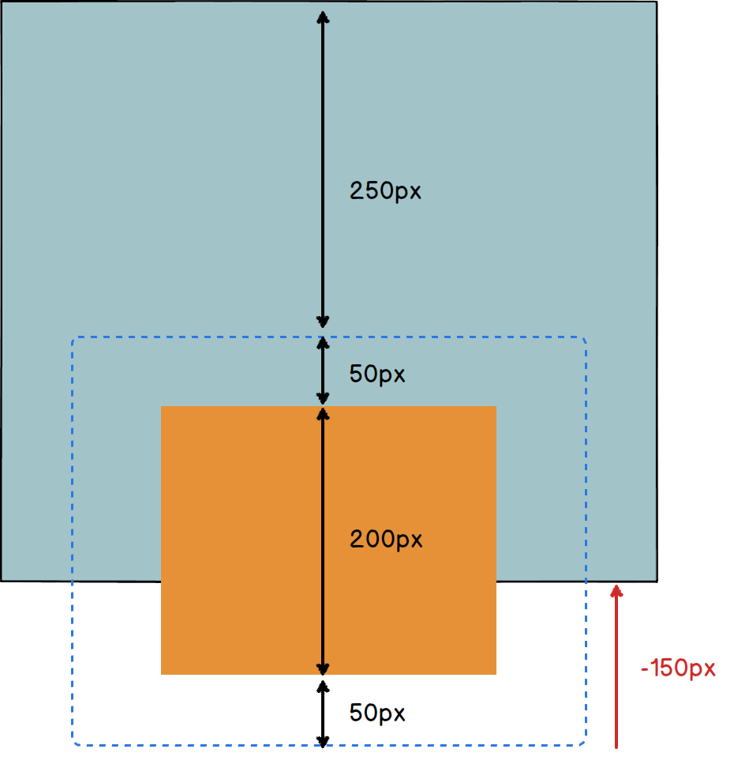
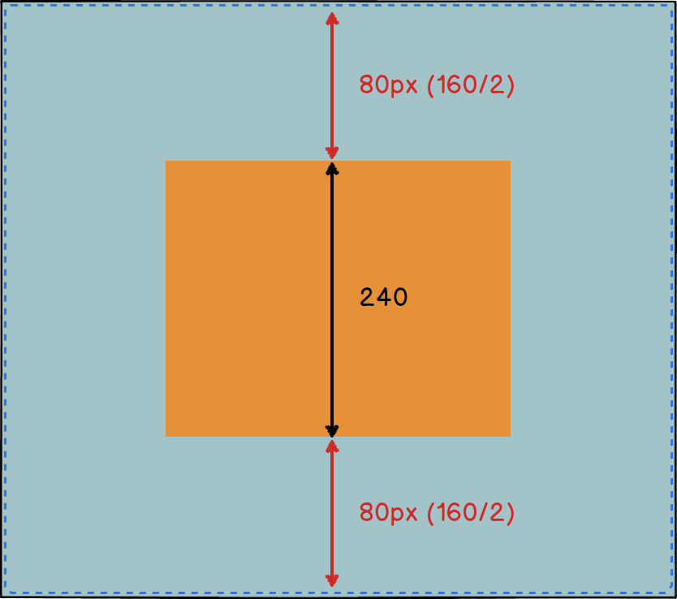
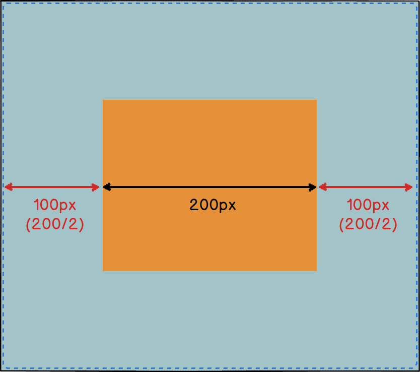
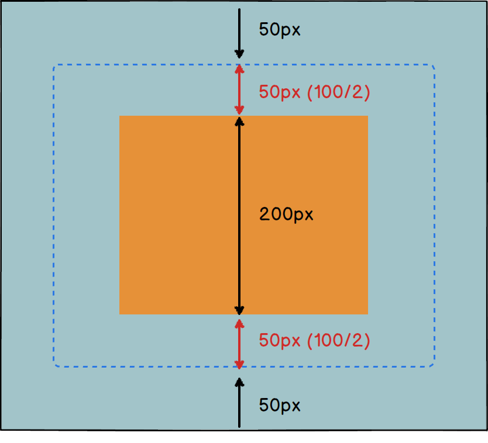
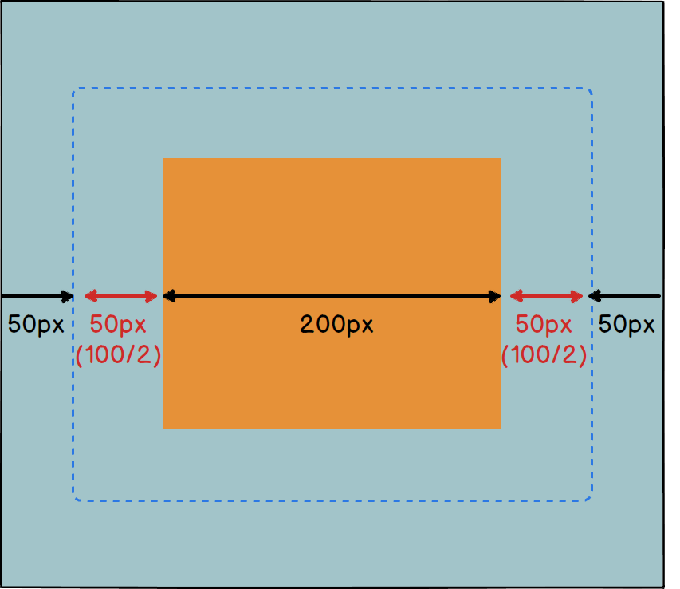

<h1 style="line-height:1.4;font-size:3em">絶対配置時にmargin autoで中央寄せになるやつ</h1>

<p style="margin-bottom:0;padding-bottom:0"><a href="https://twitter.com/Takazudo">@Takazudo</a></p>

----

## なにそれ

コレ

http://codepen.io/takazudo/pen/oXRqNG

----

## CSS

```css
.lv1 {
  width: 400px;
  height: 400px;
  position: relative;
}
.lv2 {
  width: 200px;
  height: 240px;
  position: absolute;
  left: 0;
  top: 0;
  right: 0;
  bottom: 0;
  margin: auto;
}
```

なぜ中央に寄るのか？

----

## ここに書いてある

CSS basic box model - 幅、高さ、マージンの計算 - 絶対配置された非置換要素

* [CSS basic box model](http://www.w3.org/TR/css3-box/#abs-non-replaced-width)

----

## 縦

以下全部足したのが包含ブロックの高さと等しくなる

<ul style="font-size:.7em">
<li>`top`</li>
<li>`margin-top`</li>
<li>`border-top-width`</li>
<li>`padding-top`</li>
<li>`height`</li>
<li>`padding-bottom`</li>
<li>`border-bottom-width`</li>
<li>`margin-bottom`</li>
<li>`bottom`</li>
<li>スクロールバーの高さ（もしあれば）</li>
</ul>

----

## 横

以下全部足したのが包含ブロックの幅と等しくなる

<ul style="font-size:.7em">
<li>`left`</li>
<li>`margin-left`</li>
<li>`border-left-width`</li>
<li>`padding-left`</li>
<li>`width`</li>
<li>`padding-right`</li>
<li>`border-right-width`</li>
<li>`margin-right`</li>
<li>`right`</li>
<li>スクロールバーの幅（もしあれば）</li>
</ul>

----

## ピッタリな例

* [demo](http://codepen.io/takazudo/pen/NqVYyW)

---



---



----

## 飛び出てる例

* [demo](http://codepen.io/takazudo/pen/eNaMVg)

---



----

## 上下左右marginがauto

* [demo](http://codepen.io/takazudo/pen/oXRqNG)

---



`top`、`bottom`は`0`

---



`left`、`right`は`0`

----

## top, bottomが0以外の場合

---



----

## left, rightが0以外の場合

---



----

## `auto`奥が深かった

## おわり


